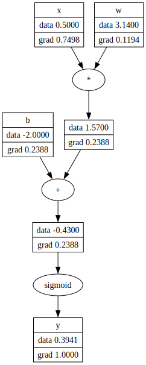

# 🎓 MicroGrad.py

> A minimal scalar-valued automatic differentiation engine built from scratch in Python.

## 📑 References

This project is based on and implements the concepts explained in the following video:

- [The spelled-out intro to neural networks and backpropagation: building micrograd](https://www.youtube.com/watch?v=VMj-3S1tku0)

## ⛽ Features

- Scalar-based `Node` class for building computation graphs
- Forward and backward pass support for gradient computation
- Operator overloading for intuitive mathematical expressions
- Basic support for:
  - Addition, subtraction, multiplication, division, exponentiation
  - Sigmoid and ReLU activations
- Graph visualization with `graphviz`

## ⚙️ Setup
1. Clone this repository
```bash
git clone https://github.com/lalitm1004/micrograd.py.git
cd micrograd.py
```

2. Install requirements
```bash
uv sync
```

3. Run using
```bash
uv run src/main.py
```
## 🕹️ Example
```py
from visualize import Visualize
from engine.node import Node

x = Node(0.5, label="x")
w = Node(3.14, label="w")
b = Node(-2.0, label="b")

y = (x * w + b**2).relu()
y.backward()

Visualize.draw(y)
```

